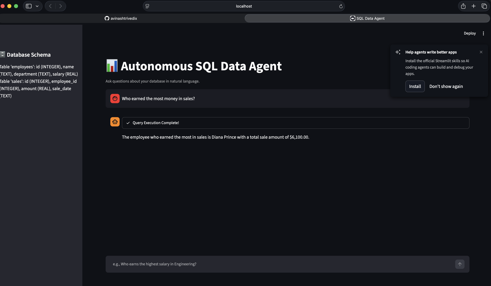

# 📊 Autonomous SQL Data Agent (Text-to-SQL)

An end-to-end autonomous AI Data Analyst built with Python, LangGraph, Streamlit, and local LLMs (Ollama). The agent converts natural language questions into executable SQL queries, inspects database schemas dynamically, enforces strict read-only safety guardrails, and presents aggregated summaries via an interactive chat interface.



## 🚀 Key Features

- **Dynamic Schema Discovery:** Queries system metadata (`PRAGMA table_info`) before query formulation to prevent column hallucination.
- **ReAct State Loop:** Powered by `LangGraph` and `LangChain` to handle complex queries, relational `JOIN` statements, and multi-table aggregations.
- **Security Guardrails:** Deterministic Python regex validation that intercepts and blocks data mutation commands (`DROP`, `DELETE`, `UPDATE`, `INSERT`).
- **Interactive UI:** Built with Streamlit, featuring real-time execution traces, generated SQL inspection, and schema sidebars.

## 🛠️ Tech Stack

- **Language:** Python 3.12 (managed via `uv`)
- **Agent Orchestration:** LangGraph / LangChain
- **LLM Runner:** Ollama (`llama3.2`)
- **Database:** SQLite
- **Frontend:** Streamlit

## ⚙️ Quickstart

1. **Clone the repository:**
   ```bash
   git clone [https://github.com/YOUR_GITHUB_USERNAME/sql-data-agent.git](https://github.com/YOUR_GITHUB_USERNAME/sql-data-agent.git)
   cd sql-data-agent